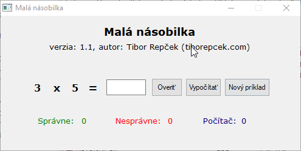

# Malá násobilka

Autor: Tibor Repček

Web: http://tiborepcek.com/mala-nasobilka/

Malá násobilka 1.1 je jednoduchý program, ktorý náhodne vyberá príklady z malej násobilky. Vy zadáte výsledok, program ho skontroluje a ak je správny, priráta zelený bod. Nesprávny výsledok je ohodnotený červeným bodom. Ak necháte príklad vypočítať za vás počítač, prirátajú sa body počítaču (modré).

Tento program je napísaný v skriptovacom jazyku [AutoIt 3](https://www.autoitscript.com/) a primárne je určený pre operačný systém Windows (testované na XP až 8). Funguje však aj cez [Wine](https://www.winehq.org/) v Linuxe (testované na [Mint](http://www.linuxmint.com/) 17.1) a bol úspešne odskúšaný tiež na Apple MacBook Air 11 s operačným systémom Mac OS X Yosemite (10.10.2) pomocou [WineBottler](http://winebottler.kronenberg.org/).
